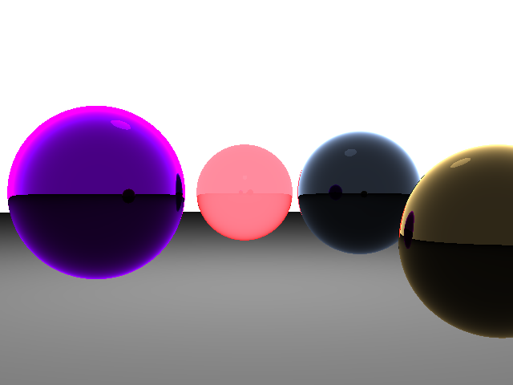
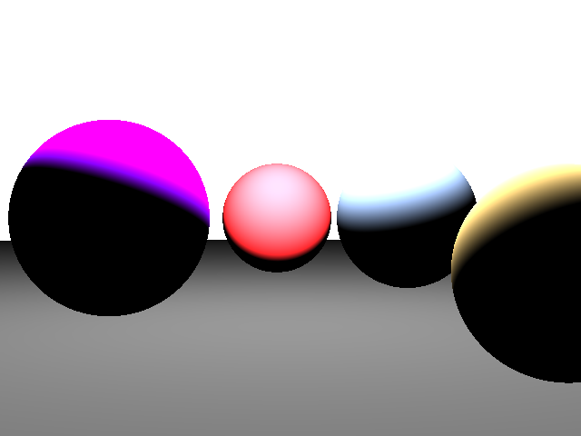

## Raytracing in JavaScript

Raytracing feito em JavaScript utilizando NodeJS e Webpack.

Raytracing simples que renderiza esferas na tela.

Projeto baseado no tutorial do [ScratchAPixel 2.0](https://www.scratchapixel.com/lessons/3d-basic-rendering/introduction-to-ray-tracing), com algumas leves alterações e adaptações para usar o canvas do navegador. 

Uma das alterações foi a utilização da função quadrática(função do segundo grau) ao inves da forma geométrica apresentada no site do ScratchAPixel 2.0.

## Imagens

Raios com 2 de Profundidade(com Transparencia e Reflexos):

Raios com 0 de Profundidade(sem Transparencia e Reflexos):

## Testando

Você pode testar como ficou [clicando aqui](https://jncjcoder.github.io/raytracingjs/index.html).